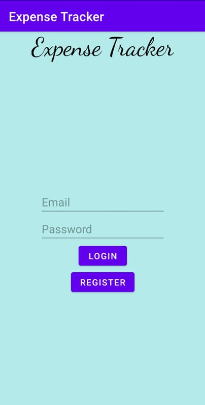
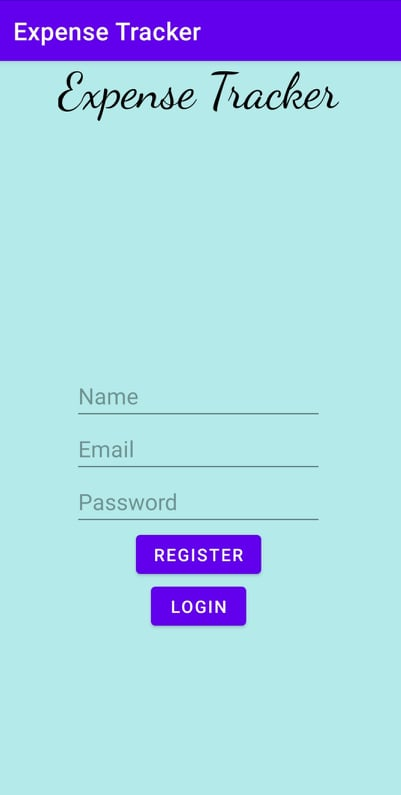

## What is the app about?

This is a very simple Expense Tracker application built using Java and Firebase. It is designed to run on Android OS mobile phones only.

## Technologies behind this:

<ol>
<li>Java</li>
<li>Firebase Authentication</li>
<li>Firebase Realtime Database</li>
</ol>

## What are the files in it:

<ol>
<li>MainActivity.java - Home page</li>
<li>User.java - User class for storing in database</li>
<li>Register.java - Registration Backend</li>
<li>Login.java - Login backend</li>
</ol>

## Screenshots:

## Upcoming Features:

1. User can do crud operations with their expenses
2. User can can get a dashboard of their expenses

This is an ongoing project and we expect to add more features in the coming days. 
